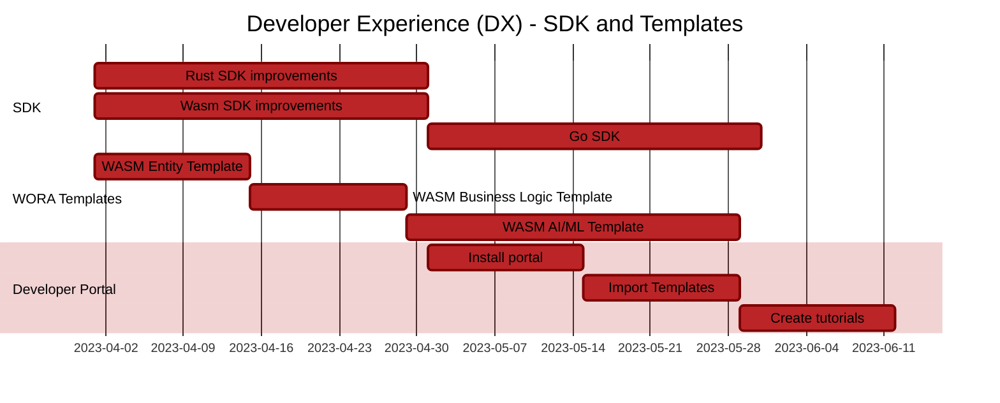
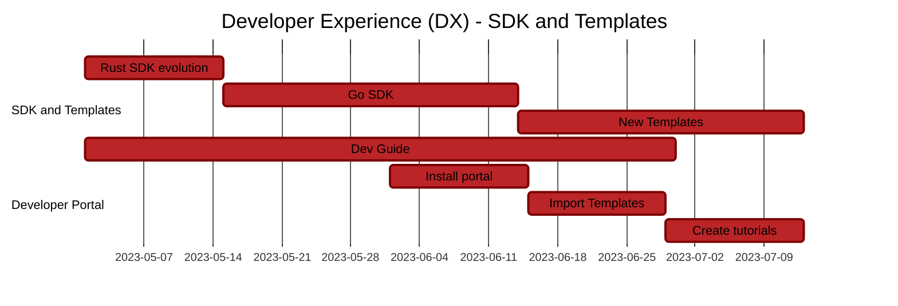
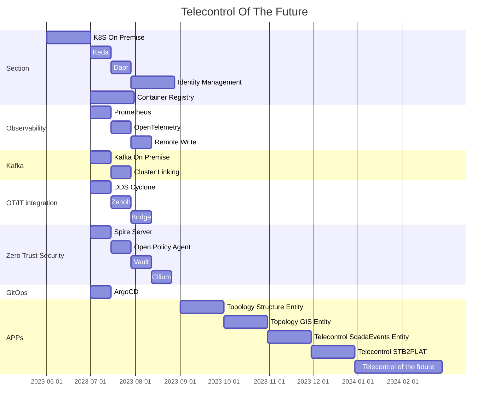
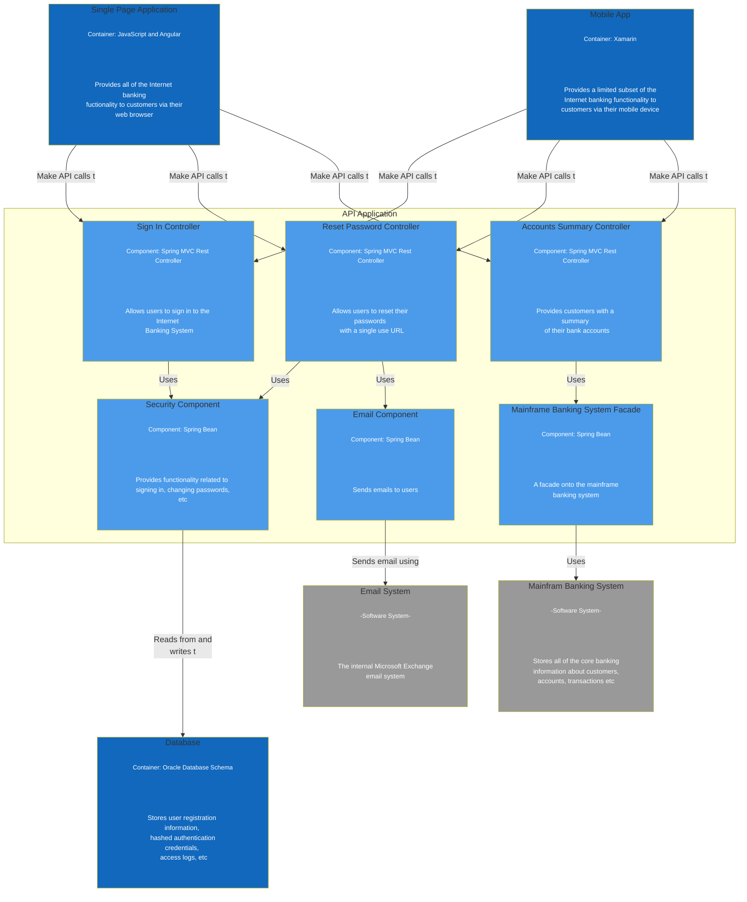

Gantt

```mermaid
%%{
  init: {
    'theme': 'base',
    'themeVariables': {
      'primaryColor': '#BB2528',
      'primaryTextColor': '#000000',
      'primaryBorderColor': '#7C0000',
      'fontSize': '32px',
      'lineColor': '#F8B229',
      'secondaryColor': '#006100',
      'tertiaryColor': '#fff'
    }
  }
}%%
gantt
    title Developer Experience (DX) - SDK and Templates
    dateFormat  YYYY-MM-DD
    section SDK
    Rust SDK improvements           :2023-04-01, 30d
    Wasm SDK improvements           :2023-04-01, 30d
    Go SDK                          :30d
    section WORA Templates
    WASM Entity Template            :2023-04-01  , 14d
    WASM Business Logic Template    :14d
    WASM AI/ML Template             :30d
    section Developer Portal
    Install portal                  :2023-05-01  , 14d
    Import Templates                :14d
    Create tutorials                :14d
```

```mermaid
%%{
  init: {
    'theme': 'base',
    'themeVariables': {
      'primaryColor': '#BB2528',
      'primaryTextColor': '#000000',
      'primaryBorderColor': '#7C0000',
      'fontSize': '32px',
      'lineColor': '#F8B229',
      'secondaryColor': '#fff',
      'tertiaryColor': '#fff'
    }
  }
}%%
gantt
    title Developer Experience (DX) - SDK and Templates
    dateFormat  YYYY-MM-DD
    section SDK and Templates
    Rust SDK evolution           :2023-05-01, 14d
    Go SDK                       :30d
    New Templates                :2023-06-14, 29d
    Dev Guide                    :2023-05-01, 60d
    section Developer Portal
    Install portal                  :2023-06-01, 14d
    Import Templates                :14d
    Create tutorials                :14d
```
Design referenced from [Book Store System](https://gitlab.com/MarioCarrion/blog-examples/-/tree/main/2020/12/30)

```mermaid
gantt
    title Telecontrol Of The Future
    dateFormat  YYYY-MM-DD
    section Section
    K8S On Premise                  : a1, 2023-06-01, 30d
    Keda                            : 14d
    Dapr                            : 14d
    Identity Management             : 30d
    Container Registry              : after a1, 30d
    section Observability
    Prometheus                      : 2023-07-01  , 14d
    OpenTelemetry                   : 14d
    Remote Write                    : 14d
    section Kafka
    Kafka On Premise                : 2023-07-01  , 14d
    Cluster Linking                 : 14d
    section OT/IT integration
    DDS Cyclone                     : 2023-07-01  , 14d
    Zenoh                           : 14d
    Bridge                          : 14d
    section Zero Trust Security
    Spire Server                    : 2023-07-01  , 14d
    Open Policy Agent               : 14d
    Vault                           : 14d
    Cilium                          : 14d
    section GitOps
    ArgoCD                          : 2023-07-01  , 14d
    section APPs
    Topology Structure Entity       : 2023-09-01  , 30d
    Topology GIS Entity             : 30d
    Telecontrol ScadaEvents Entity  : 30d
    Telecontrol STB2PLAT            : 30d
    Telecontrol of the future       : 60d
```

```mermaid
flowchart TB

subgraph singlePageApplication[Single Page Application]
    direction LR
    h3[Container: JavaScript and Angular]:::type
    d3[Provides all of the Internet banking\nfuctionality to customers via their\nweb browser]:::description
end
singlePageApplication:::internalContainer

subgraph mobileApp[Mobile App]
    direction LR
    h4[Container: Xamarin]:::type
    d4[Provides a limited subset of the\nInternet banking functionality to\ncustomers via their mobile device]:::description
end
mobileApp:::internalContainer

subgraph database[Database]
    direction LR
    h6[Container: Oracle Database Schema]:::type
    d6[Stores user registration information, \n hashed authentication credentials, \n access logs, etc]:::description
end
database:::internalContainer

subgraph mainframeBankingSystem[Mainfram Banking System]
    h98[-Software System-]:::type
    d98[Stores all of the core banking \n information about customers, \n accounts, transactions etc]:::description
end
mainframeBankingSystem:::externalSystem

subgraph emailSystem[Email System]
    h99[-Software System-]:::type
    d99[The internal Microsoft Exchange \n email system]:::description
end
emailSystem:::externalSystem

singlePageApplication--Make API calls to-->signInController
singlePageApplication--Make API calls to-->resetPasswordController
singlePageApplication--Make API calls to-->accountsSummaryController
mobileApp--Make API calls to-->signInController
mobileApp--Make API calls to-->resetPasswordController
mobileApp--Make API calls to-->accountsSummaryController

subgraph apiApplication[API Application]
    subgraph signInController[Sign In Controller]
        direction LR
        h10[Component: Spring MVC Rest Controller]:::type
        d10[Allows users to sign in to the Internet \n Banking System]:::description
    end
    signInController:::internalComponent

    subgraph resetPasswordController[Reset Password Controller]
        direction LR
        h20[Component: Spring MVC Rest Controller]:::type
        d20[Allows users to reset their passwords \n with a single use URL]:::description
    end
    resetPasswordController:::internalComponent

    subgraph accountsSummaryController[Accounts Summary Controller]
        direction LR
        h30[Component: Spring MVC Rest Controller]:::type
        d30[Provides customers with a summary \n of their bank accounts]:::description
    end
    accountsSummaryController:::internalComponent

    subgraph securityComponent[Security Component]
        direction LR
        h40[Component: Spring Bean]:::type
        d40[Provides functionality related to \n signing in, changing passwords, etc]:::description
    end
    securityComponent:::internalComponent

    subgraph emailComponent[Email Component]
        direction LR
        h50[Component: Spring Bean]:::type
        d50[Sends emails to users]:::description
    end
    emailComponent:::internalComponent

    subgraph mainframeBankingSystemFacade[Mainframe Banking System Facade]
        direction LR
        h60[Component: Spring Bean]:::type
        d60[A facade onto the mainframe \n banking system]:::description
    end
    mainframeBankingSystemFacade:::internalComponent

    signInController--Uses-->securityComponent
    resetPasswordController--Uses-->securityComponent
    resetPasswordController--Uses-->emailComponent
    accountsSummaryController--Uses-->mainframeBankingSystemFacade
end

securityComponent--Reads from and \n writes to-->database
emailComponent--Sends email using-->emailSystem
mainframeBankingSystemFacade--Uses-->mainframeBankingSystem

%% Element type definitions

classDef person fill:#08427b
classDef internalContainer fill:#1168bd
classDef internalComponent fill:#4b9bea
classDef externalSystem fill:#999999

classDef type stroke-width:0px, color:#fff, fill:transparent, font-size:12px
classDef description stroke-width:0px, color:#fff, fill:transparent, font-size:13px
```
